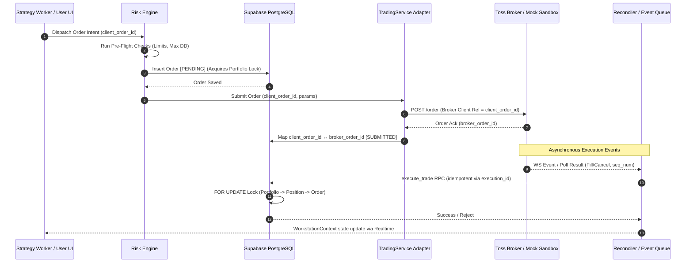
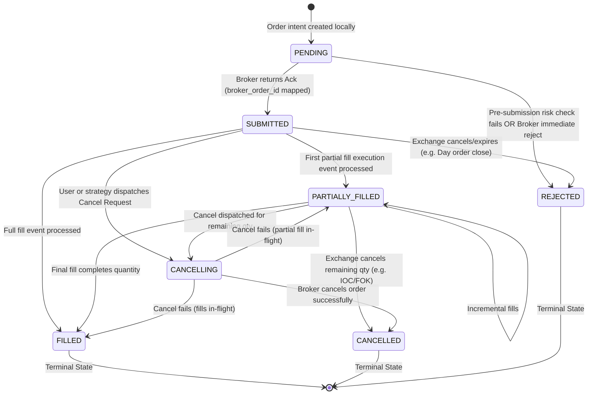
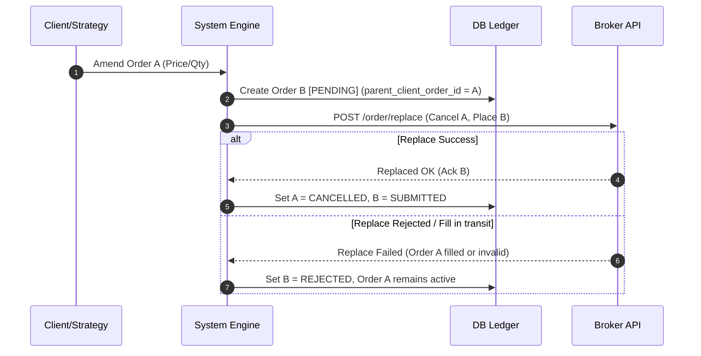

# Broker Order Mapping Architecture

This document establishes the official specifications and system design for the **Broker Order Mapping Architecture** of the Toss AI Trading Platform. It addresses the critical stabilization findings regarding duplicate executions, broker event replays, reconciliation races, and concurrent portfolio update safeties.

---

## 1. Architecture Overview

The Broker Order Mapping Architecture acts as the bridge between the local client/AI workstation state, the PostgreSQL database ledger, and external brokerage engines (Simulation, Paper, or Live Toss Open API). It ensures that every trade intent generated by a user or an AI strategy has a persistent, auditable lifecycle, and resolves any discrepancies between local state and broker state.

### High-Level System Data Flow



---

## 2. Core Database Schema

To support partial fills, cancellations, replacements, and secure deduplication, we expand the original database schema defined in [20260602000000_init_schema.sql](file:///c:/Users/김규호/Desktop/토스%20자동매매%20프로그램%20v2(taste-skill)/supabase/migrations/20260602000000_init_schema.sql).

### PostgreSQL Migrations

```sql
-- 1. Extend or Create Order Status and Types
do $$
begin
  if not exists (select 1 from pg_type where typname = 'order_status_v2') then
    create type public.order_status_v2 as enum (
      'PENDING', 
      'SUBMITTED', 
      'PARTIALLY_FILLED', 
      'FILLED', 
      'CANCELLING', 
      'CANCELLED', 
      'REJECTED'
    );
  end if;
end
$$;

-- 2. Refined Orders Table
create table if not exists public.orders (
  client_order_id uuid primary key default gen_random_uuid(),
  broker_order_id varchar(100) unique, -- Enforces 1-to-1 mapping
  user_id uuid references auth.users on delete cascade not null,
  symbol varchar(10) not null,
  side varchar(10) not null check (side in ('BUY', 'SELL')),
  type varchar(10) not null check (type in ('MARKET', 'LIMIT')),
  qty numeric(12, 4) not null check (qty > 0),
  price numeric(16, 4) check (price >= 0), -- NULL for MARKET orders
  status public.order_status_v2 default 'PENDING' not null,
  filled_qty numeric(12, 4) default 0.0000 not null check (filled_qty >= 0),
  avg_fill_price numeric(16, 4) default 0.0000 not null check (avg_fill_price >= 0),
  parent_client_order_id uuid references public.orders(client_order_id) on delete set null,
  trading_mode varchar(20) not null check (trading_mode in ('SIMULATION', 'PAPER', 'LIVE')),
  last_sequence_number bigint default 0 not null,
  error_message text,
  created_at timestamptz not null default now(),
  updated_at timestamptz not null default now()
);

-- Indexing for Order Mapping and Joins
create index if not exists idx_orders_user_id on public.orders(user_id);
create index if not exists idx_orders_broker_order_id on public.orders(broker_order_id);
create index if not exists idx_orders_parent_client_order_id on public.orders(parent_client_order_id);
create index if not exists idx_orders_status_mode on public.orders(status, trading_mode);

-- 3. Broker Execution Events Table (Audit & Deduplication)
create table if not exists public.broker_execution_events (
  execution_id varchar(100) primary key, -- Unique ID from broker (or generated for mock)
  client_order_id uuid references public.orders(client_order_id) on delete cascade not null,
  broker_order_id varchar(100) not null,
  event_type varchar(20) not null check (event_type in ('ACK', 'PARTIAL_FILL', 'FULL_FILL', 'CANCEL', 'REPLACE', 'REJECT')),
  sequence_number bigint not null,
  filled_qty numeric(12, 4) not null check (filled_qty >= 0),
  execution_price numeric(16, 4) not null check (execution_price >= 0),
  raw_payload jsonb not null,
  processed_at timestamptz not null default now()
);

create index if not exists idx_broker_events_client_order_id on public.broker_execution_events(client_order_id);
create index if not exists idx_broker_events_seq on public.broker_execution_events(broker_order_id, sequence_number);

-- 4. Order State Audit Trail
create table if not exists public.order_audit_trail (
  id uuid primary key default gen_random_uuid(),
  client_order_id uuid references public.orders(client_order_id) on delete cascade not null,
  actor varchar(20) not null check (actor in ('SYSTEM', 'USER', 'AI_BOT')),
  action_type varchar(30) not null, -- 'STATE_TRANSITION', 'API_DISPATCH', 'RECONCILIATION_SYNC'
  old_status public.order_status_v2,
  new_status public.order_status_v2 not null,
  change_details jsonb,
  created_at timestamptz not null default now()
);

create index if not exists idx_order_audit_client_id on public.order_audit_trail(client_order_id);
```

### Idempotent Portfolio Settlement RPC (`execute_trade_v2`)

This function updates the portfolio balance and position holdings. It acts as the only path for writing executions and enforces idempotency by checking the `execution_id`.

```sql
create or replace function public.execute_trade_v2(
  p_execution_id varchar(100),
  p_client_order_id uuid,
  p_fill_qty numeric(12, 4),
  p_fill_price numeric(16, 4),
  p_sequence_number bigint,
  p_raw_payload jsonb
)
returns json
language plpgsql
security definer
as $$
declare
  v_user_id uuid;
  v_symbol varchar(10);
  v_side varchar(10);
  v_trading_mode varchar(20);
  v_current_status public.order_status_v2;
  
  v_total_cost bigint;
  v_cash_balance bigint;
  v_current_qty numeric(12, 4) := 0;
  v_avg_buy_price numeric(16, 4) := 0;
  v_new_qty numeric(12, 4);
  v_new_avg_buy_price numeric(16, 4);
  v_position_id uuid;
begin
  -- 1. Authenticate user
  v_user_id := auth.uid();
  if v_user_id is null then
    raise exception 'Unauthorized: Authentication required.';
  end if;

  -- 2. Idempotency Check: Prevent duplicate processing of the same execution event
  if exists (select 1 from public.broker_execution_events where execution_id = p_execution_id) then
    return json_build_object(
      'success', true, 
      'message', 'Execution already processed.', 
      'execution_id', p_execution_id
    );
  end if;

  -- 3. Row-Lock the Target Order and fetch parameters
  select symbol, side, status, trading_mode 
  into v_symbol, v_side, v_current_status, v_trading_mode
  from public.orders
  where client_order_id = p_client_order_id and user_id = v_user_id
  for update;

  if not found then
    raise exception 'Order record % not found or permission denied.', p_client_order_id;
  end if;

  -- Verify order is not already in a terminal state
  if v_current_status in ('FILLED', 'CANCELLED', 'REJECTED') then
    raise exception 'Cannot apply execution % to order in terminal state %.', p_execution_id, v_current_status;
  end if;

  -- Integer conversion of KRW pricing to support current schema limits
  v_total_cost := (p_fill_qty * p_fill_price)::bigint;

  -- 4. Row-Lock the Portfolio
  select cash_balance into v_cash_balance
  from public.portfolio
  where user_id = v_user_id
  for update;

  if not found then
    raise exception 'Portfolio record not initialized for user.';
  end if;

  -- 5. Mutate Portfolio and Positions based on Side
  if v_side = 'BUY' then
    if v_cash_balance < v_total_cost then
      raise exception 'Insufficient balance: cash balance is %, purchase cost is %.', v_cash_balance, v_total_cost;
    end if;

    update public.portfolio
    set cash_balance = cash_balance - v_total_cost,
        updated_at = now()
    where user_id = v_user_id;

    -- Row-Lock Position
    select id, qty, avg_buy_price into v_position_id, v_current_qty, v_avg_buy_price
    from public.positions
    where user_id = v_user_id and symbol = v_symbol
    for update;

    if found then
      v_new_qty := v_current_qty + p_fill_qty;
      v_new_avg_buy_price := round((v_current_qty * v_avg_buy_price + v_total_cost) / v_new_qty);

      update public.positions
      set qty = v_new_qty,
          avg_buy_price = v_new_avg_buy_price,
          updated_at = now()
      where id = v_position_id;
    else
      insert into public.positions (user_id, symbol, qty, avg_buy_price)
      values (v_user_id, v_symbol, p_fill_qty, p_fill_price);
    end if;

  elsif v_side = 'SELL' then
    select id, qty into v_position_id, v_current_qty
    from public.positions
    where user_id = v_user_id and symbol = v_symbol
    for update;

    if not found or v_current_qty < p_fill_qty then
      raise exception 'Insufficient shares: owned %, requested sale quantity is %.', v_current_qty, p_fill_qty;
    end if;

    update public.portfolio
    set cash_balance = cash_balance + v_total_cost,
        updated_at = now()
    where user_id = v_user_id;

    v_new_qty := v_current_qty - p_fill_qty;

    if v_new_qty > 0 then
      update public.positions
      set qty = v_new_qty,
          updated_at = now()
      where id = v_position_id;
    else
      delete from public.positions where id = v_position_id;
    end if;

  else
    raise exception 'Invalid trade side specification.';
  end if;

  -- 6. Log the execution event to prevent replays
  insert into public.broker_execution_events (
    execution_id, client_order_id, broker_order_id, 
    event_type, sequence_number, filled_qty, 
    execution_price, raw_payload, processed_at
  ) values (
    p_execution_id, p_client_order_id, (select broker_order_id from public.orders where client_order_id = p_client_order_id), 
    'PARTIAL_FILL', p_sequence_number, p_fill_qty, 
    p_fill_price, p_raw_payload, now()
  );

  -- 7. Update order metrics and state
  update public.orders
  set filled_qty = filled_qty + p_fill_qty,
      avg_fill_price = round((filled_qty * avg_fill_price + v_total_cost) / (filled_qty + p_fill_qty)),
      status = case 
                 when (filled_qty + p_fill_qty) >= qty then 'FILLED'::public.order_status_v2
                 else 'PARTIALLY_FILLED'::public.order_status_v2
               end,
      last_sequence_number = p_sequence_number,
      updated_at = now()
  where client_order_id = p_client_order_id;

  -- 8. Log state transition audit
  insert into public.order_audit_trail (
    client_order_id, actor, action_type, old_status, new_status, change_details
  ) values (
    p_client_order_id, 'SYSTEM', 'STATE_TRANSITION', v_current_status,
    (select status from public.orders where client_order_id = p_client_order_id),
    json_build_object('fill_qty', p_fill_qty, 'fill_price', p_fill_price, 'execution_id', p_execution_id)
  );

  return json_build_object(
    'success', true,
    'client_order_id', p_client_order_id,
    'status', (select status from public.orders where client_order_id = p_client_order_id),
    'cum_qty', (select filled_qty from public.orders where client_order_id = p_client_order_id),
    'avg_price', (select avg_fill_price from public.orders where client_order_id = p_client_order_id)
  );

exception
  when others then
    -- Implicit transaction rollback is executed on exception triggers
    raise;
end;
$$;
```

---

## 3. Order Mapping Relationships

### Entity Relationship Diagram (ERD)

```text
  +-------------------+              +-------------------------+
  |   portfolios      |              |   broker_execution      |
  +-------------------+              |        _events          |
  | PK: user_id       |              +-------------------------+
  +---------+---------+              | PK: execution_id        |
            |                        | FK: client_order_id     |
            | 1                      |     sequence_number     |
            |                        +------------+------------+
            | N                                   | N
  +---------v---------+                           |
  |     orders        |<--------------------------+ 1
  +-------------------+
  | PK: client_order_id| (UUIDv4 generated on client/worker)
  | UK: broker_order_id| (Mapped 1-to-1 once acknowledged)
  | FK: parent_order_id| (Self-reference for replace intents)
  +---------+---------+
            | 1
            |
            | N
  +---------v---------+
  | order_audit_trail |
  +-------------------+
  | PK: id            |
  | FK: client_order_id|
  +-------------------+
```

### Key Constraints & Integrity Rules
*   `orders.broker_order_id` is defined as a `UNIQUE` nullable column. Once the broker returns the official identifier, this column is populated. The unique constraint prevents mapping two distinct local orders to the same broker entity.
*   **Chain-of-Intents Pattern**: Replacement orders form a parent-child chain. If order $B$ replaces order $A$, then `orders(B).parent_client_order_id = orders(A).client_order_id`. This allows the UI to reconstruct the timeline of changes.

---

## 4. Order Lifecycle State Machine



### Guarding State Transitions
No system process may transition an order out of the terminal states (`FILLED`, `CANCELLED`, `REJECTED`). Any database transaction attempting to write an update to a terminal order will trigger an exception and rollback.

---

## 5. Partial Fill Handling

A single limit order may fill incrementally over hours. 

### Accumulation Process
1.  **Event Received**: A `PARTIAL_FILL` event is received via WebSockets or Polling.
2.  **Verify Event sequence**: Compare `sequence_number` of the event with `orders.last_sequence_number`. If the incoming sequence number is lower, reject the event as stale.
3.  **Execute RPC**: Call [execute_trade_v2](file:///c:/Users/김규호/Desktop/토스%20자동매매%20프로그램%20v2(taste-skill)/supabase/migrations/20260602000000_init_schema.sql#L125) (using the execution's specific ID to guarantee idempotency).
4.  **Portfolio Balance Adjustment**: The RPC deducts/adds funds proportionate *only* to the incremental quantity filled (`p_fill_qty * p_fill_price`), rather than the total order amount.
5.  **Average Fill Price Formula**: The database dynamically calculates the cumulative average fill price of the order:
    $$\text{avg\_fill\_price}_{\text{new}} = \frac{(\text{filled\_qty}_{\text{current}} \times \text{avg\_fill\_price}_{\text{current}}) + (\text{fill\_qty} \times \text{fill\_price})}{\text{filled\_qty}_{\text{current}} + \text{fill\_qty}}$$

---

## 6. Cancellation Handling

### State Sequence & Flow

```text
[Active Order] ──(Click Cancel)──> [CANCELLING] ──(Dispatch REST)──> [Broker Engine]
                                                                          │
                                       ┌──────────────────────────────────┴─────────────────┐
                             (Broker Confirms Cancel)                           (In-flight Fill Completed First)
                                       │                                                    │
                                       ▼                                                    ▼
                                  [CANCELLED]                                            [FILLED]
```

### In-Flight Fill Race Conditions
If a user submits a cancel request while a fill is in transit:
1.  **Scenario A (Fill Lands First)**: The database processes the execution event. Order status moves to `FILLED`. The broker subsequently rejects the cancellation request. The adapter maps the broker reject to a local log event. The order status remains `FILLED`.
2.  **Scenario B (Cancel Confirmed First)**: The database processes the cancel event. The order moves to `CANCELLED`. If a late fill event for the order subsequently arrives (due to broker queue lag), the database transaction in `execute_trade_v2` throws an exception because it cannot apply fills to a terminal state, triggering an alert.

---

## 7. Order Replacement Flow

To amend an order (changing price or quantity), the platform uses the **Cancel-Replace** pattern to maintain auditability.



*   **Double Exposure Prevention**: The capital for Order $B$ is not fully locked until Order $A$ is verified as cancelled or modified. The Risk Engine verifies this condition using a temporary hold check on the portfolio's purchasing power.

---

## 8. Reconciliation Architecture

Reconciliation runs constantly on a three-tier scheduler:

| Tier | Name | Interval | Purpose |
| --- | --- | --- | --- |
| **Tier 1** | In-Flight Sweeper | Every 15 seconds | Scans all orders stuck in `PENDING`, `SUBMITTED`, or `CANCELLING` state. Queries broker API via `/order/status` and syncs states. |
| **Tier 2** | Connection Gap Sync | On WebSocket Reconnect | Fetches executions from the broker starting from the timestamp of the last recorded local execution. |
| **Tier 3** | End-of-Day (EOD) Audit | Daily at Market Close | Fetches the complete broker trade log for the past 24 hours. Executes a line-by-line reconciliation against the local `orders` and `broker_execution_events` tables. |

---

## 9. WebSocket + Polling Coordination

To prevent race conditions where a fast polling query and a delayed WebSocket event process the same status update concurrently, the system uses **Event Serializing**:

1.  **Monotonic Sequence Numbers**: Every message from the broker contains a sequence number.
2.  **Atomic Sequence Filter**: Before processing any update, the database updates the row `orders.last_sequence_number`.
    ```sql
    UPDATE public.orders
    SET status = p_new_status, last_sequence_number = p_sequence_number
    WHERE client_order_id = p_client_order_id 
      AND p_sequence_number > last_sequence_number;
    ```
    If `p_sequence_number <= last_sequence_number`, the event is safely discarded as a duplicate or out-of-order delivery.

---

## 10. Duplicate Event Prevention

Duplicate webhook notifications, WebSocket frames, or polling payloads are handled via two safeguards:

1.  **Unique Constraint on `broker_execution_events(execution_id)`**: Since every fill event is assigned a unique transaction identifier by the broker, any duplicate event attempting to write to this table will violate the primary key constraint, forcing a transaction rollback.
2.  **Atomic RPC Guards**: Inside `execute_trade_v2`, the check:
    ```sql
    if exists (select 1 from public.broker_execution_events where execution_id = p_execution_id) then ...
    ```
    handles duplicates gracefully without raising an exception to the client, logging the event as a warning instead.

---

## 11. Idempotency Strategy

### Key Generation & Retries
*   **Client Order ID Generation**: Generated on the client side (in [workstation-context.tsx](file:///c:/Users/김규호/Desktop/토스%20자동매매%20프로그램%20v2(taste-skill)/lib/context/workstation-context.tsx) or by the server-side Strategy Worker) prior to submitting the request over the network.
*   **Request Lifecycle**:
    ```text
    Generate client_order_id (UUID) -> Save to Local DB (PENDING) -> Transmit to Broker API
           ▲                                                               │
           │                     (Network Drop / Timeout)                  │
           └───────────────────────────────────────────────────────────────┘
                               Re-transmit with SAME client_order_id
    ```
*   **Broker Deduplication**: The Toss Open API/Mock Sandbox identifies duplicate `client_order_id` values and returns the existing order details instead of creating a new position.

---

## 12. Database Locking Strategy

To prevent race conditions on shared balances and portfolios, database locks must be acquired in a strict, predictable order:

### Locking Order

$$\text{Portfolio} \longrightarrow \text{Positions} \longrightarrow \text{Orders}$$

```sql
BEGIN;

-- 1. Lock Portfolio first
SELECT cash_balance 
FROM public.portfolio 
WHERE user_id = v_user_id 
FOR UPDATE;

-- 2. Lock Position next
SELECT qty 
FROM public.positions 
WHERE user_id = v_user_id AND symbol = v_symbol 
FOR UPDATE;

-- 3. Lock Order last
SELECT status 
FROM public.orders 
WHERE client_order_id = p_client_order_id 
FOR UPDATE;

-- Perform updates
UPDATE ...
COMMIT;
```

### Deadlock Avoidance
By locking tables in this exact order, two parallel executions will queue up instead of deadlocking. For example, if two fills arrive at the same millisecond for the same portfolio, Transaction 2 will block on the Portfolio lock until Transaction 1 commits.

---

## 13. Failure Modes & Mitigations

| Failure Mode | Impact | Mitigation Plan |
| :--- | :--- | :--- |
| **API Timeout during order placement** | Local database is marked `PENDING`, but it is unknown if the broker received the order. | Mark the order as `PENDING_VERIFY`. Run an active sweeper poll query within 5 seconds using the `client_order_id`. If the broker has the order, link the IDs and set state to `SUBMITTED`. If the broker has no record, transition the order to `REJECTED`. |
| **Database connection lost during fill** | The broker executes the fill, but local positions and cash remain unchanged. | On database recovery, the Connection Gap Sync process polls the broker API starting from the last known execution timestamp, fetching all missed executions and applying them. |
| **Out-of-order execution event delivery** | A final `FULL_FILL` event is processed prior to a delayed `PARTIAL_FILL` event. | The monotonic sequence filter rejects the incoming `PARTIAL_FILL` event because its sequence number is lower than `orders.last_sequence_number` (which was updated to the `FULL_FILL` sequence number). |
| **Deadlock on rapid executions** | Transactions fail and roll back. | The system utilizes the strict locking order (Portfolio -> Position -> Order) and retries aborted transactions automatically at the service layer up to 3 times. |

---

## 14. Recovery Procedures

### 1. Manual State Reset RPC
If an order gets stuck in a non-terminal state due to a major database outage, administrators can call a restricted RPC to query the broker and force a state transition:

```sql
create or replace function public.force_sync_order_state(
  p_client_order_id uuid,
  p_target_status public.order_status_v2,
  p_reason text
)
returns void
language plpgsql
security definer
as $$
begin
  -- Restrict execution to authorized service roles
  if current_setting('role') != 'service_role' then
    raise exception 'Unauthorized.';
  end if;

  update public.orders
  set status = p_target_status,
      error_message = p_reason,
      updated_at = now()
  where client_order_id = p_client_order_id;

  insert into public.order_audit_trail (
    client_order_id, actor, action_type, old_status, new_status, change_details
  ) values (
    p_client_order_id, 'SYSTEM', 'RECONCILIATION_SYNC', null, p_target_status,
    json_build_object('reason', p_reason, 'manual_override', true)
  );
end;
$$;
```

### 2. Discrepancy Alerting
Any nightly EOD reconciliation check that fails to balance (mismatch in cash balances or position shares > 0) will automatically trigger an alert to the platform's incident logging system and freeze further automated executions for that portfolio.

---

## 15. Audit Logging

Every state transition must be logged inside the `order_audit_trail` table. The JSON column `change_details` records the context:

### Audit JSON Payload Example (Partial Fill)
```json
{
  "fill_qty": 20,
  "fill_price": 70200,
  "execution_id": "exec-92138",
  "reconciled": false,
  "broker_latency_ms": 142
}
```

### Audit JSON Payload Example (Sync / Replay)
```json
{
  "reason": "WebSocket disconnect gap synchronization",
  "manual_override": false,
  "reconciled_by": "ConnectionGapSyncWorker",
  "historical_gap_filled": true
}
```

---

## 16. Broker Integration Boundaries

The `TradingService` isolation layer prevents the workstation client context from interacting with broker APIs directly. 

```text
                             ┌───────────────────┐
                             │  TradingService   │
                             └─────────┬─────────┘
                                       │
                ┌──────────────────────┼──────────────────────┐
                ▼                      ▼                      ▼
      [Simulation Mode]          [Paper Mode]            [Live Mode]
      Uses local database        Streams live prices;    Queries live broker
      sandbox. Bypasses          simulates fills via     endpoints; executes
      API calls.                 mock orders.            transactions via RPC.
```

### Mode Behavior Matrix

| Feature | Simulation Mode | Paper Mode | Live Mode |
| :--- | :--- | :--- | :--- |
| **Market Data** | Mock price generator | Live WebSocket stream | Live WebSocket stream |
| **Order Placement** | Instant fill mock | Simulated liquidity check | Toss REST API (`POST /order`) |
| **Order Status** | Local db event | Local simulation loop | Webhooks / Polling / WebSockets |
| **Settlement Path** | [execute_trade_v2](file:///c:/Users/김규호/Desktop/토스%20자동매매%20프로그램%20v2(taste-skill)/supabase/migrations/20260602000000_init_schema.sql#L125) (Virtual) | [execute_trade_v2](file:///c:/Users/김규호/Desktop/토스%20자동매매%20프로그램%20v2(taste-skill)/supabase/migrations/20260602000000_init_schema.sql#L125) (Virtual) | [execute_trade_v2](file:///c:/Users/김규호/Desktop/토스%20자동매매%20프로그램%20v2(taste-skill)/supabase/migrations/20260602000000_init_schema.sql#L125) (Real Broker) |
| **Secrets Used** | None | Public API Keys | Encrypted pg_sodium Keys |
