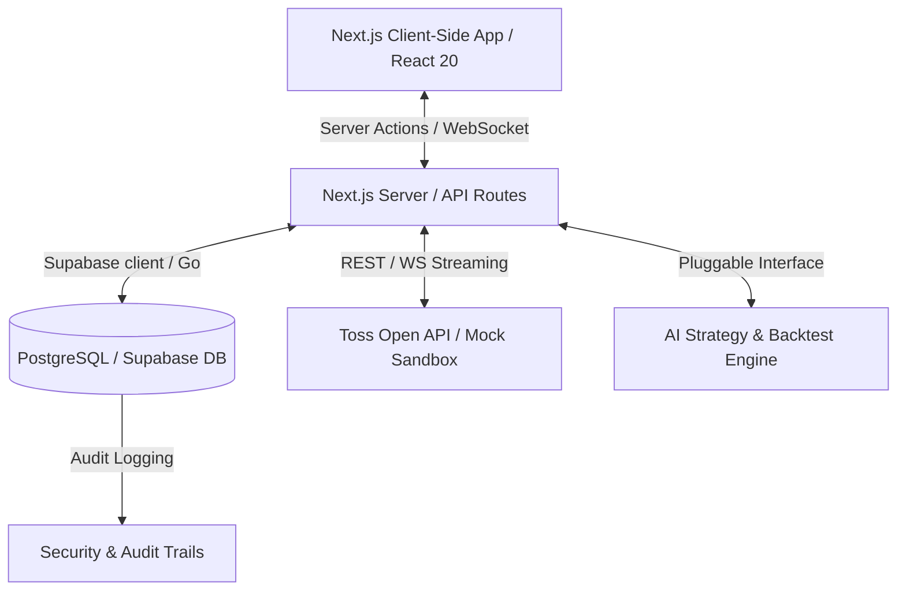

# Development Roadmap: Toss AI Trading Platform v2 (MVP)

This document outlines the engineering plan and roadmap for the MVP version of the AI-powered trading platform, built using **Next.js 16**, **React 20**, **TypeScript**, **Tailwind CSS v5**, and **Supabase/PostgreSQL**. It incorporates **Taste Skill** design principles and adheres to the strict code quality, security, and trading safety rules defined in [Agent.md](file:///c:/Users/김규호/Desktop/토스%20자동매매%20프로그램%20v2(taste-skill)/Agent.md).

---

## 🏗️ System Architecture Overview

### Key Architectural Guidelines
1. **Simulation-First Toggle:** Since the Toss Open API is upcoming, the trading engine must support a `SIMULATION_MODE` flag. All API interactions (order requests, market data, asset tracking) will flow through a unified service layer that maps to either the real Toss API client or a local Sandbox Mock service.
2. **Explainable AI Pipeline:** AI strategy decisions are saved to PostgreSQL with structured JSON schemas (`reasoning`, `metrics`, `confidence`, `risk_parameters`) and exposed in the UI.
3. **Execution Guardrails:** Stop-loss (SL) and Take-profit (TP) rules are executed at the server/worker layer. Order status is never assumed; we always check, retry with exponential backoff, and update state reactively.

---

## 📅 Roadmap: Phased MVP Execution

### Phase 1: Foundation & Security Setup (Week 1)
Establish the repository structure, database schemas, authentication, and core API wrapper.

*   **1.1 Project Bootstrapping:** Initialize Next.js 16 (App Router) with React 20, TypeScript, and Tailwind CSS v5. Configure linting and testing frameworks (`npm run lint`, `npm run build`, `npm run test`).
*   **1.2 Database Schema Design:** Create Supabase migration files for the following database entities:
    *   `users` / `accounts`: User profile and multi-account configurations.
    *   `api_credentials`: Securely encrypted credentials (e.g., Toss API keys, JWT tokens) stored using PgSodium/Vault.
    *   `portfolios` / `positions`: Tracking cash balance, purchasing power, exposure, and individual security holdings.
    *   `orders` / `executions`: Logs of all placed, filled, cancelled, or failed orders with audit trails.
    *   `ai_strategies` / `backtests`: Schema for storing trading bot logic, criteria, and historical backtest logs.
*   **1.3 Auth & Row-Level Security (RLS):** Set up Supabase Auth and construct strict PostgreSQL RLS policies to guarantee that users can only view or modify their own data.
*   **1.4 Toss API Unified Wrapper:** Create a service interface `TossTradingService` containing actions:
    *   `getMarketData(symbol)`
    *   `placeOrder(orderRequest)`
    *   `cancelOrder(orderId)`
    *   `getAccountBalance()`
    *   `getPositions()`
    Implement a high-fidelity `MockTossService` that simulates brokerage responses.

---

### Phase 2: Core Trading Engine & Safety Guardrails (Week 2)
Implement the order execution state machine, position managers, and safety limits.

*   **2.1 Position Management:** Implement the core mathematical logic for calculating average cost basis, realized/unrealized PnL, and total portfolio value.
*   **2.2 Order State Machine:** Build a state manager for orders: `PENDING` ➔ `SUBMITTED` ➔ `FILLED` / `REJECTED` / `CANCELLED`. Build retry handling for network drops.
*   **2.3 Risk Management Engine:** Add backend validation filters before submitting orders:
    *   *Max Drawdown Check:* Stop buying if the portfolio drops below a specified daily threshold.
    *   *Exposure Limit:* Enforce max capital allocation percentage per asset (e.g., max 15% per stock).
    *   *Order Throttle:* Enforce rate limits to prevent rogue loops from placing hundreds of orders.
*   **2.4 SL/TP Execution Layer:** Set up server-side monitoring for Stop-Loss and Take-Profit conditions, automatically triggering mock or real market sell orders when price thresholds are crossed.

---

### Phase 3: Premium UI Dashboard & Real-Time Data (Week 3)
Build a brokerage-grade dashboard following **Taste Skill** guidelines (clean, high-density, professional).

*   **3.1 Spacing & Color System (Tailwind v5):** Define a unified Design System (light/dark mode parity) inspired by modern brokerage apps (like Toss Securities):
    *   Neutral HSL palettes instead of plain colors.
    *   Accessible contrast ratios.
    *   Strict typography scale (Inter/Outfit).
*   **3.2 Real-time Dashboard Layout (Mobile-First):**
    *   *Top Section:* Portfolio value, daily change (green/red micro-indicators), asset breakdown chart.
    *   *Middle Section:* Tabs for Positions, Open Orders, Watchlists, Trade History.
    *   *Right/Bottom Panel:* Market price feeds and stock search.
*   **3.3 Order Execution Terminal:** Create an intuitive order drawer with input validations:
    *   Sliders for account percentage allocation.
    *   Instant estimation of total order cost + commissions.
    *   Clear Buy/Sell buttons with distinct visual hierarchy.
*   **3.4 WebSocket/SSE Setup:** Stream real-time market prices to the client components to refresh the portfolio value and active stock charts instantly.

---

### Phase 4: AI Strategy Engine & Backtesting (Week 4)
Build the AI bot engine, strategy metrics analytics, and historical simulators.

*   **4.1 AI Strategy Controller:** Create a pluggable runtime controller where AI strategies generate trading signals (`BUY`, `SELL`, `HOLD`) with a specified confidence score.
*   **4.2 Explainable AI Panel (Taste Skill visual polish):**
    *   Render a clean UI card explaining *why* the AI decided to signal a buy/sell.
    *   Display indicators used (e.g., RSI, Moving Averages, News sentiment) alongside a confidence bar.
    *   Show risk parameters associated with this strategy.
*   **4.3 Backtester Engine:** Develop a historical data simulator:
    *   Feeds historical candle data into selected strategies.
    *   Simulates trades and outputs metrics: CAGR, Max Drawdown, Sharpe Ratio, Win/Loss Ratio.
    *   Displays performance charts comparing the strategy against buy-and-hold benchmarks.

---

### Phase 5: Verification, Integration & Deployment (Week 5)
Conduct end-to-end security audits, automated testing, and final packaging.

*   **5.1 Error Injection Testing:** Simulate network drops, API timeouts, invalid credentials, and rate limits to verify that the system recovers gracefully.
*   **5.2 Pre-flight Visual and Accessibility Check:** Confirm complete compliance with WCAG accessibility guidelines, test light/dark contrast scales, and ensure zero boilerplate/template visual slop.
*   **5.3 Deployment Pipeline:** Setup GitHub Actions to run linting, build verification, and tests on push. Deploy the Next.js app to Vercel/Edge and database configurations to Supabase.

---

## ⚠️ Risks & Mitigation Strategies

| Risk Category | Potential Impact | Mitigation Strategy |
| :--- | :--- | :--- |
| **API Timeout / Outage** | Rogue or missing executions leading to financial loss. | **Strict Retry & Reconciliation:** Every order has a confirmation loop. If an API request times out, check order status via query before attempting any retry. Enforce client-side circuit breakers. |
| **Flawed AI Signaling** | AI model bug triggers massive consecutive buy/sell loops. | **Hard Backend Guardrails:** Implement hard limits on daily trade counts and total capital allocation. If consecutive trades exceed limits, temporarily freeze automated execution. |
| **Toss Open API Schema Changes** | System breaks upon API release. | **Adapter Pattern:** Maintain a decoupled adapter layer. Any API schema adjustments only require updating the adapter, leaving the core database and UI logic untouched. |
| **Aesthetics / Slop** | Dashboard looks like a generic boilerplate template. | **Taste Skill Integration:** Restrict layout variance to structured editorial grid systems. Use custom spring transitions, crisp typography, and Harmonized colors. |
