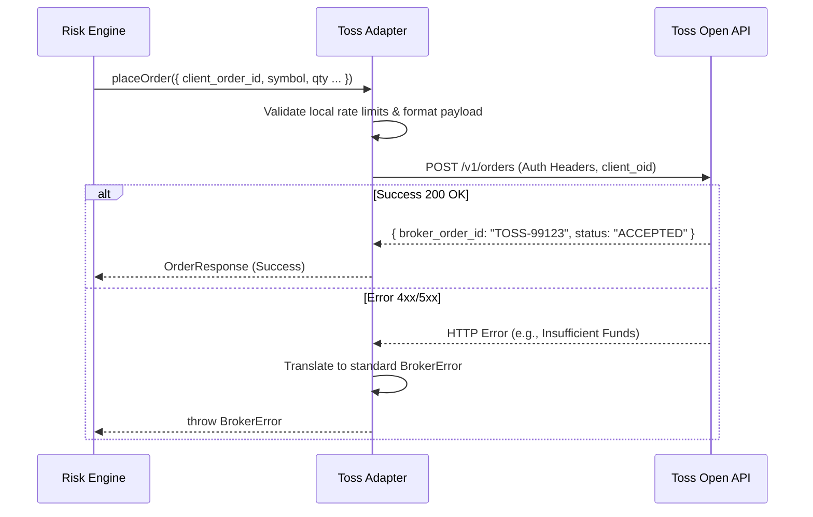

# Toss Adapter Skeleton Architecture

This document establishes the official specifications and system design for the **Toss Adapter Skeleton Architecture**. It defines the concrete implementation blueprint for integrating the upcoming Toss Open API, ensuring it fits seamlessly into the existing `TradingService` abstraction while preserving all established trading safety, risk management, and broker mapping protocols.

---

## 1. Adapter Overview

The Toss Adapter (`TossTradingService`) is the concrete realization of the `TradingService` interface designed specifically for live market execution. It translates standardized internal intents (e.g., `OrderRequest`) into Toss-specific API calls and maps Toss responses back to our unified domain models.

It operates strictly within the **Live Mode** context, fully isolated from the `MockSandbox` (Simulation Mode) and `PaperTradingService` (Paper Mode). The upstream application (Risk Engine, Strategy Worker, UI) is completely unaware of the underlying Toss implementation details.

---

## 2. TradingService Integration

The Toss Adapter implements the stable `TradingService` interface:

```typescript
export class TossTradingService implements TradingService {
  async placeOrder(request: OrderRequest): Promise<OrderResponse> { /* ... */ }
  async cancelOrder(orderId: string): Promise<boolean> { /* ... */ }
  async getAccountBalance(): Promise<AccountBalance> { /* ... */ }
  async getPositions(): Promise<Position[]> { /* ... */ }
  async getMarketPrice(symbol: string): Promise<number> { /* ... */ }
}
```

*   **Translation Layer:** Standard types like `BUY` or `MARKET` are translated to Toss-specific enum values (e.g., `2` for buy, `01` for market) before dispatching the HTTP request.
*   **Response Mapping:** The Toss response containing the real exchange order ID is mapped to our `broker_order_id`.

---

## 3. Account Linking Architecture

Integration with Toss requires secure credential management.

*   **Credential Storage:** Toss API keys (or OAuth refresh tokens) will be stored in the `api_credentials` table, heavily encrypted using `pg_sodium` or an equivalent Vault integration.
*   **Decryption:** The Node.js server retrieves and decrypts the credentials in memory per request.
*   **Authentication Flow:** The adapter generates secure signatures (e.g., HMAC-SHA256) or bearer tokens to authenticate requests to the Toss API endpoints. Keys never touch the browser context.

---

## 4. Order Submission Flow



*   **Idempotency:** The `client_order_id` is passed as a custom tracking ID (e.g., `client_oid` or `request_id`) to the Toss API to prevent duplicate submissions on network retries.

---

## 5. Order Cancellation Flow

Cancellation requests require referencing both the local and broker order IDs.

1.  **Request:** System calls `TossTradingService.cancelOrder(broker_order_id)`.
2.  **Dispatch:** Adapter issues an HTTP DELETE or POST to the Toss cancellation endpoint (e.g., `/v1/orders/{broker_order_id}/cancel`).
3.  **Handling:** The adapter parses the broker's acknowledgment and returns a boolean success flag, leaving the database state transitions to the central Broker Order Mapping architecture.

---

## 6. Execution Reporting Flow

To handle partial and full fills in real-time, the adapter must ingest execution reports from Toss.

*   **Ingestion Vector:** Depending on Toss capabilities, this will be a WebSocket stream (preferred) or a REST Webhook endpoint exposed by our Next.js server (`/api/webhooks/toss/executions`).
*   **Payload Translation:** The adapter receives a Toss execution event, translates it into the standard `broker_execution_events` schema, and pushes it to the local Reconciler Queue.
*   **Settlement:** The queue processor invokes the `execute_trade` RPC using the Toss execution ID, guaranteeing idempotent portfolio updates.

---

## 7. Portfolio Synchronization

A reconciliation mechanism to align the local Supabase `portfolio` with the actual Toss account.

*   **Trigger:** Executed on user login, periodically (e.g., every 10 minutes), and End-of-Day (EOD).
*   **Flow:** The adapter calls `/v1/account/balance` and `/v1/account/positions` on the Toss API.
*   **Resolution:** The local reconciliation worker compares the Toss reality against the local database. Discrepancies (e.g., manual trades made in the Toss native app) are resolved by adjusting local tables and generating a sync audit log.

---

## 8. Market Data Integration

The `TossTradingService` integrates with the unified `MarketDataProvider` architecture.

*   **Data Stream:** Instead of hitting Toss REST APIs for every price tick, the adapter connects to the Toss Market Data WebSocket stream.
*   **Fan-out:** The server-side adapter receives Toss price ticks, normalizes them, and broadcasts them to connected Next.js clients via Server-Sent Events (SSE) or Supabase Realtime.
*   **Protection:** Clients never connect directly to Toss market data streams, protecting API keys and centralizing rate limits.

---

## 9. Error Handling Model

The adapter maps proprietary Toss error codes to a standardized internal taxonomy.

| Toss Example Code | Internal Taxonomy | Action |
| :--- | :--- | :--- |
| `ERR_INSUFFICIENT_FUNDS` | `InsufficientFundsError` | Reject order, alert user. |
| `ERR_RATE_LIMIT` | `RateLimitExceededError` | Trigger circuit breaker, exponential backoff. |
| `ERR_MARKET_CLOSED` | `MarketClosedError` | Reject order, queue for next open (optional). |
| `HTTP 503` | `BrokerNetworkError` | Queue status poll, warn UI. |

---

## 10. Rate Limiting Strategy

To prevent Toss from suspending the API key, the adapter enforces client-side rate limits before dispatching HTTP requests.

*   **Token Bucket:** Implemented via Redis (or in-memory for MVP).
*   **Limits:** Tracks separate buckets for Order Placement, Order Modification, and Market Data querying based on official Toss API quotas.
*   **Circuit Breaker:** If Toss returns a `429 Too Many Requests`, the adapter trips a circuit breaker, pausing automated AI strategy workers for a cooldown period.

---

## 11. Security Boundaries

*   **No Client Secrets:** Toss API keys are strictly confined to the server environment.
*   **IP Whitelisting:** The Toss developer portal will be configured to only accept requests originating from our production Vercel/Edge Server IP ranges.
*   **Sanitization:** Any Toss raw payloads saved to `broker_execution_events.raw_payload` are scrubbed of API keys or sensitive authorization headers before logging.

---

## 12. Failure Modes

| Failure Mode | Impact | Toss Adapter Mitigation |
| :--- | :--- | :--- |
| **Toss API Outage (503)** | New orders fail; active orders unknown. | Adapter throws `BrokerOutageError`. Risk Engine halts automated trading. Fallback to polling for active order status recovery. |
| **Toss WS Disconnect** | Missed execution reports. | Adapter automatically attempts reconnect with exponential backoff. Triggers connection gap sync via REST upon reconnection. |
| **Malformed Toss Response** | Payload parsing fails. | Adapter logs raw payload for debugging and raises a critical alert. Halts processing of the specific event to prevent corruption. |

---

## 13. Recovery Procedures

*   **EOD True-Up:** Daily execution of the Portfolio Synchronization flow to force local balances to match Toss authoritative balances.
*   **Manual Re-sync:** Administrator/User UI button to force an API call to Toss `/v1/orders/{id}` to refresh a stuck local order.
*   **State Reconstruction:** Ability to replay the raw execution webhooks saved in the database to rebuild local state if the `execute_trade` RPC pipeline faults.

---

## 14. Migration Path From Paper Mode

Transitioning from `PaperTradingService` to the live `TossTradingService` requires zero changes to core business logic.

1.  **Configuration:** Change `.env` setting `NEXT_PUBLIC_TRADING_MODE=LIVE`.
2.  **Credential Input:** User inputs Toss API credentials via a secure UI settings panel, saving them to `api_credentials`.
3.  **Instantiation:** The `services/trading/index.ts` factory instantiates `TossTradingService` instead of `PaperTradingService`.
4.  **Execution:** The Risk Engine, Strategy Worker, and Workstation UI continue to operate normally, completely abstracted from the switch to live capital.

---

## 15. Open Questions Pending Toss API Release

The final adapter implementation cannot be coded until the following are clarified by Toss Open API documentation:

1.  **Authentication Spec:** Does Toss use standard OAuth 2.0 (requiring a callback URL and token refresh loop) or static API Keys (header-based)?
2.  **Idempotency Support:** Does the `/order` endpoint natively accept and deduplicate based on a client-provided UUID (`client_oid`)?
3.  **Real-Time Delivery:** Are execution reports delivered via WebSocket (requires persistent server connection) or Webhooks (requires exposed public endpoint)?
4.  **Rate Limit Topography:** What are the exact transactions-per-second (TPS) limits for market vs. limit orders vs. cancel requests?
5.  **Market Data Granularity:** Is Level 2 (Order Book) data available, or only Level 1 (Top of Book / Last Trade)?
